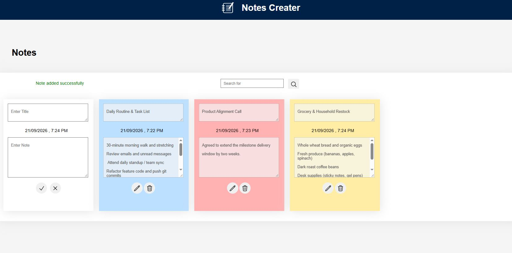

#  Notes Creater

A clean, web-first and mobile-responsive note-taking application designed with a colorful sticky-notes interface. Easily capture ideas, manage daily task lists, and organize your thoughts with color-coded cards and instant search.

---

## Key Features

- **Sticky Note Card UI:** Distinct pastel color-coded cards (Blue, Red, Yellow) for visual organization.
-  **Quick Add Card:** Persistent note-creation card with title, content body, and quick save/cancel actions.
-  **Auto Timestamps:** Automatically records date and time for every note created or updated.
-  **Instant Search:** Search bar to quickly filter and locate specific notes.
-  **Full CRUD Operations:** Seamlessly add, edit, view, and delete notes.
- **Cross-Platform:** Designed with a responsive layout adaptable for both Web and Android APK builds.

---

##  Tech Stack

- **Frontend:** HTML5, CSS3, JavaScript
- **Styling:** Custom CSS (Modern Cards & Flex/Grid Layouts)
- **Native Wrapper (APK):** Capacitor / Android Webview
- **Storage:** LocalStorage / Browser Cache

---
##  Preview & Screenshots

Preview

---
